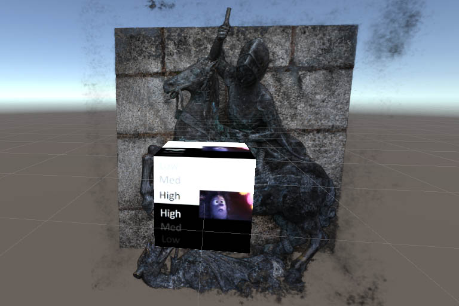
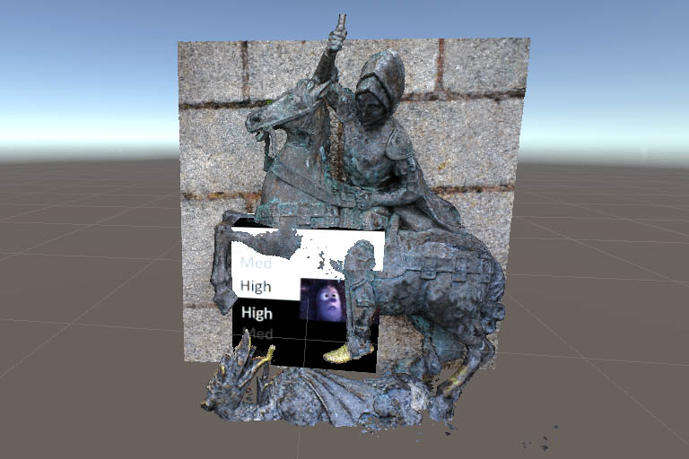
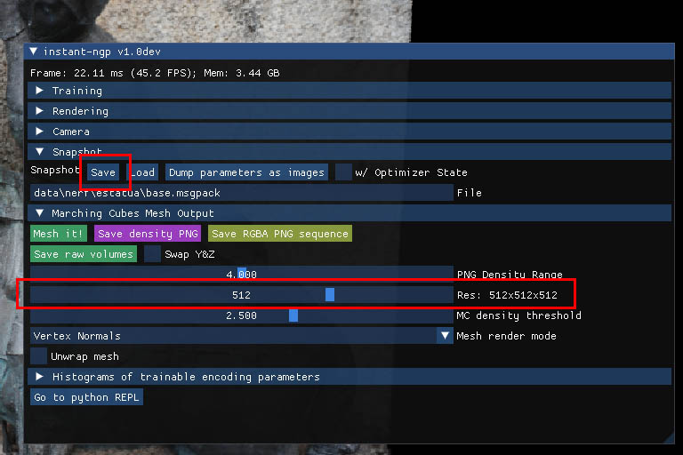
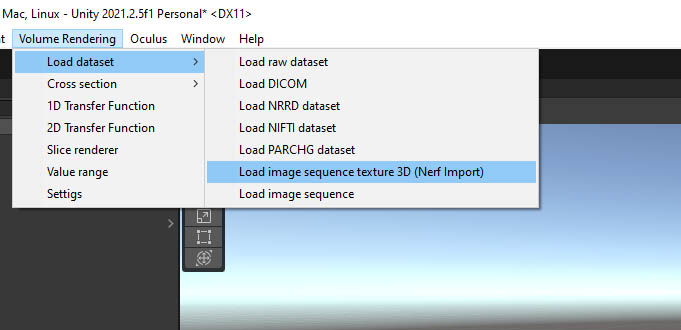
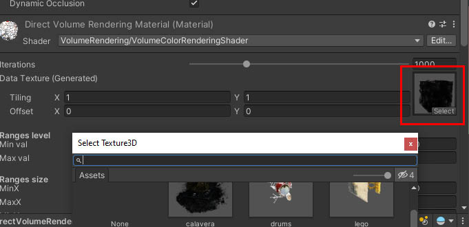

# Nerf Unity for Oculus Quest 2

 Nerf Unity for Oculus Quest 2 is a fork of the project  [kwea123/nerf_Unity](kwea123/nerf_Unity), which is a Unity implementation of nerf_pl, a neural rendering technique for creating photorealistic images. The fork adds support for the Oculus Quest 2 virtual reality headset and includes a new shader and tools for importing 3D volume data as png sequences. The project includes several different scenes that demonstrate different ways to use the neural rendering techniques, including rendering 3D mesh models and volumes. The project is built on Unity 2022.2.1f1 and requires assets to be downloaded from the release page and imported into Unity before use.

## Diferences with the original project

- added [https://github.com/mattatz/unity-volume-rendering/](https://github.com/mattatz/unity-volume-rendering/) to the project, which is a Unity implementation of volume rendering using raymarching, and the volume reder imports.
- Added support for Oculus Quest 2
- Changed to the new shader to VolumeColorRenderingShader
- Create import from Nerf png sequence files

  
## Requirements

- Unity 2022.2.1f1
- add folder Vol to Assets, in this folder is imported the volume data textures
- add oculus integration to the project (https://assetstore.unity.com/packages/tools/integration/oculus-integration-82022)

# Shaders

## VolumeShad2 (old shader)

Original in: https://github.com/kwea123/nerf_Unity/blob/master/Assets/Shaders/volumeShad2.shader

This is the old shader of the original project. It uses a number of custom properties to control its behavior, such as the volume texture to be rendered, the number of iterations used in the rendering process, and various options for how the volume should be rendered (such as whether to use RGB values to control alpha, or whether to use a dissolve effect). It also defines a number of ranges to control the visible region of the volume. The shader contains a sample function that clips the volume to the specified ranges and applies the selected rendering options before returning the resulting color.

- _Volume is a 3D texture that contains the volume data to be rendered.
- _Iteration is an integer value that specifies the number of iterations to use in the - rendering process.
- _AlphaCutoff is a value in the range 0 to 1 that specifies the threshold below which - alpha values will be considered transparent.
- _cutoff is a toggle (0 or 1) that enables or disables the use of the alpha cutoff value.
- _alphaTransition is a value in the range 0 to 1 that specifies how smoothly the alpha - values should transition from opaque to transparent.
- _rgbAlpha is a toggle (0 or 1) that enables or disables the use of RGB values to control - the alpha channel.
- _MinX, _MaxX, _MinY, _MaxY, _MinZ, and _MaxZ are values in the range 0 to 1 that specify - the minimum and maximum values for the X, Y, and Z axes, respectively. These values are - used to clip the volume.
- _Dissolve is a toggle (0 or 1) that enables or disables the use of a dissolve effect.
- _Normalized is a toggle (0 or 1) that enables or disables normalization of the volume - data.

## VolumeColorRenderingShader (new shader)

@references:
    - https://github.com/mattatz/unity-volume-rendering/blob/master/Assets/VolumeRendering/Shaders/VolumeRendering.cginc
    - https://kwea123.github.io/nerf_pl/

This shader is a custom shader for rendering 3D volumes. It uses the raymarching technique to render the 3D volume. It's designed to be used with a 3D data texture that represents the volume, and it provides a number of adjustable properties to control how the volume is rendered.

The main properties of this shader are:

- _Iteration: This controls the number of iterations that the raymarching algorithm will use to render the volume. More iterations will produce a higher-quality rendering, but will also be slower.
- _DataTex: This is the 3D data texture that represents the volume that will be rendered.
- _MinVal and _MaxVal: These properties control the minimum and maximum values that will be used to map the data in the 3D texture to colors in the final rendering.
- _alphaTransition: This property controls the transition between transparent and opaque regions of the volume.
- _alphaFactor: This property controls the overall transparency of the volume.
- _deptFactor: This property controls the depth of the volume.
- _lightFactor: This property controls the intensity of the lighting applied to the volume.
- _lighting: This property toggles the use of lighting in the rendering.
- _Noise: This property toggles the use of noise in the rendering.
- _NoiseTex: This is the 2D data texture that represents the noise that will be used in the rendering.
- _noiseFactor: This property controls the intensity of the noise.    
- _MinX, _MaxX, _MinY, _MaxY, _MinZ, _MaxZ: These properties control the size of the volume. 

The shader also includes a number of helper functions for performing common tasks related to volume rendering, such as finding intersections between rays and bounding boxes, and computing the 

## Import from instant-Nerf png sequence files

- Save the volume data as png sequence files in instant-nerf https://github.com/NVlabs/instant-ngp, you can change the resolution of image sequence in res slider.

- The images are saved in the folder "rgba_slices" in the folder of instant-nerf project

- Import the png sequence files into the project

- The volume texture is created in the folder Vol with the name "Assets/Vol/VolumeRendering3D" + DateTime.Now.ToString("yyyyMMddHHmmss") + ".asset"

- Select onVolumeShaderNew object, the material is changed to data texture to imported texture.

# Project Nerf_Unity original README

### :gem: [**Project page**](https://kwea123.github.io/nerf_pl/) (live demo!)

Unity projects for my implementation of [nerf_pl (Neural Radiance Fields)](https://github.com/kwea123/nerf_pl)

Update : Now you can view the volume from **inside**! See [video](https://youtu.be/JJfG2G5ebv4)

### Tutorial and demo videos

# Installation and usage

This project is built on Unity 2019.3.9f1 on **Windows**. It contains 3 scenes (under `Scenes/` folder):
*  [MeshRender](#meshrender)
*  [MixedReality](#mixedreality)
*  [VolumeRender](#volumerender)

Due to large size of the files, I put the assets in [release](https://github.com/kwea123/nerf_Unity/releases), you need to download from there and import to Unity. **Make sure you download them and put under `Assets/` before opening Unity.** Follow the instructions below for each scene:

### If you want to use your own data, please see [this](https://github.com/kwea123/nerf_pl/blob/master/README_Unity.md) and [videos](https://www.youtube.com/playlist?list=PLDV2CyUo4q-K02pNEyDr7DYpTQuka3mbV) to train on your own data first.

## MeshRender

Render reconstructed meshes.

### Data preparation

1.  Download the mesh files (`*.ply`) from [here](https://github.com/kwea123/nerf_Unity/releases)
2.  Follow the below image to add the mesh to scene:
    *  Select gameobject
    *  Drag mesh into the missing parts

## MixedReality

Render a real scene with correct depth values, where you can add virtual objects and get accurate occlusion effect (visual effect only).

### Data preparation
If you're using linux, it seems `StreamingAssets` cannot be correctly imported [#2](/../../issues/2). In this case, try to manually enter the path to files into the missing parts. 

## VolumeRender
Volume render a virtual object.

### Data preparation

1.  Download the volume files (`*.vol`) from [here](https://github.com/kwea123/nerf_Unity/releases)
2.  Follow the below image to add the volume to scene:
    *  Select gameobject
    *  Drag vol into the missing part

